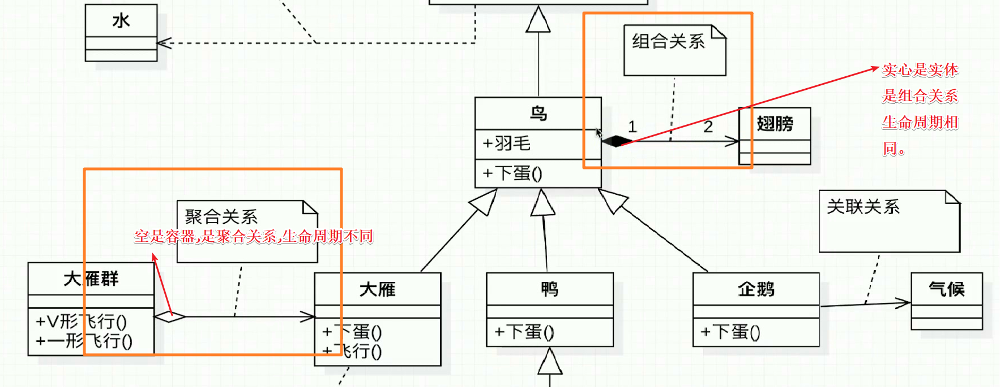
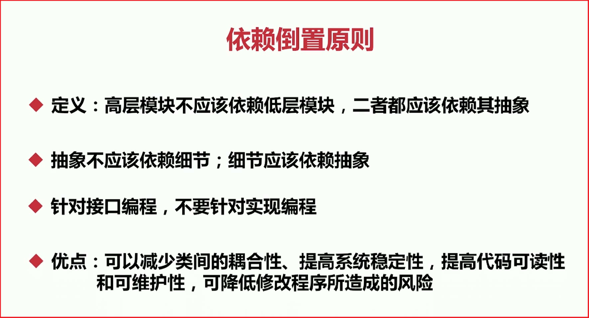

# Java设计模式学习
> 用于3刷Java设计模式。
>
> 在我们学习设计模式的时候,一定要快速转变我们的**在代码编写中的角色**,就拿工厂模式为例,在编写工厂类代码的时候,我们的角色就是工厂。而通过工厂获取到我们想要的内容时,我们就是用户。

## 设计模式学习概览

根据上图我们可以知道,设计模式真正的本质就是,**前人总结的经验,提供给后人去借鉴使用。**

### 开闭原则的注意点

不是说只要代码带动了就叫"修改了代码"。开闭原则指的是在改变源头(比如某个工具类)时,以前的老代码无需进行修改。新代码直接用新的内容就行了。这样就符合了开闭原则就是说对扩展开放，对修改关闭。扩展api,对老代码的修改关闭、屏蔽。换一个说法就是在我们对自己写的框架api进行升级的时候,只要client(虽然这种场景下很有可能就是我们)的代码没有改变,那么就是符合开闭原则的。切记在玩Java设计模式的时候角色的转变!

站在使用api客户的角度来讲,框架api升级后,原有代码并没有改动,只是用户可以使用新增的api接口了。

## UML类图的一点分析

组合关系为强联系。关联关系为弱联系。

依赖关系是虚线箭头,表示弱关系,一般用于参数和返回值有关系的情况下。

关联关系是实线箭头,表示强关系,一般用于某个对象中有另外一个

至于类与父类或接口的指向问题,以为只有子类知道他的父类是谁,所以肯定是子类指向父类,因为父类没有办法去指向子类(java集成的特性决定了)。

## UML时序图

这里今后再做补充。

## 7大设计原则

首先指出,设计原则不是强行遵守的,而是要讲究一个度,讲究一个平衡,讲究一个取舍。

### 开闭原则

**实现开闭原则的核心就是面向抽象编程。**而不是面向具体的实现编程。因为抽象相对是稳定的,让类去依赖与稳定的抽象,所以对于修改来说就是封闭的,而通过面向对象的继承以及多态的机制,就可以实现对抽象体的继承了,通过重写改变其固有方法,或者实现新的扩展方法,当变化发生时,我们可以创建抽象来隔离以后可能发生的变化。

开闭原则的就是用抽象来创建框架,用实现来扩展细节。

我们在写代码时应该注意,越低层次的模块、越基础的模块发生变化影响的范围是越大的。越高层的模块变化影响的范围会越小。简单的理解,如果我们一个dao层发生变化,那我们的影响就会非常巨大,比如这次试用mybatis-plus与activiti在一开始的思路中,想要更换dao层,那工作量可想真的是非常巨大了。如果不遵守开闭原则,那么我们在修改a模块的时候,很可能就会影响b模块。就比如我们要改dao层,那么service与controller都很有可能收到影响!

在课程中,通过继承的方式,是的我们对代码的修改是关闭的对扩展是开放的。

还需要一个注意点,应用程序的代码肯定是有改变的,所有的设计原则不应该把应用层的代码拿出来考虑。

### 依赖倒置原则

