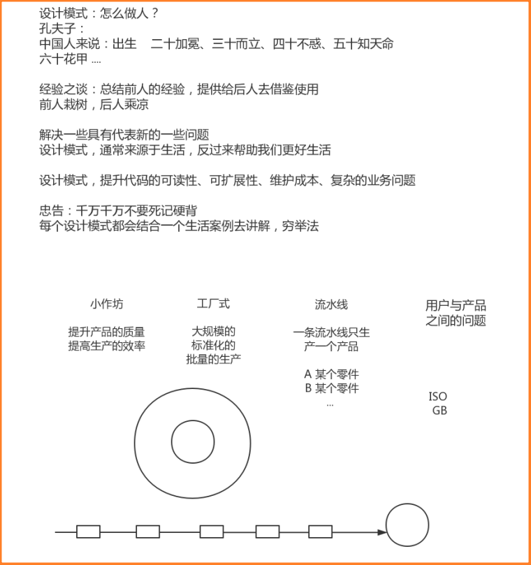

# Java设计模式学习
> 用于3刷Java设计模式。
>
> 在我们学习设计模式的时候,一定要快速转变我们的**在代码编写中的角色**,就拿工厂模式为例,在编写工厂类代码的时候,我们的角色就是工厂。而通过工厂获取到我们想要的内容时,我们就是用户。

## 设计模式学习概览

根据上图我们可以知道,设计模式真正的本质就是,**前人总结的经验,提供给后人去借鉴使用。**

### 开闭原则的注意点

不是说只要代码带动了就叫"修改了代码"。开闭原则指的是在改变源头(比如某个工具类)时,以前的老代码无需进行修改。新代码直接用新的内容就行了。这样就符合了开闭原则就是说对扩展开放，对修改关闭。扩展api,对老代码的修改关闭、屏蔽。换一个说法就是在我们对自己写的框架api进行升级的时候,只要client(虽然这种场景下很有可能就是我们)的代码没有改变,那么就是符合开闭原则的。切记在玩Java设计模式的时候角色的转变!

## 工厂模式

### 小作坊式的工厂模式

纲要:用户本身不再关心生产的过程,而只关心结果。

### 工厂方法模式

在实际生活中,工厂这个概念对用户来说本身也是一个比较抽象的概念。工厂本身也是一个抽象的模型,是一个接口。